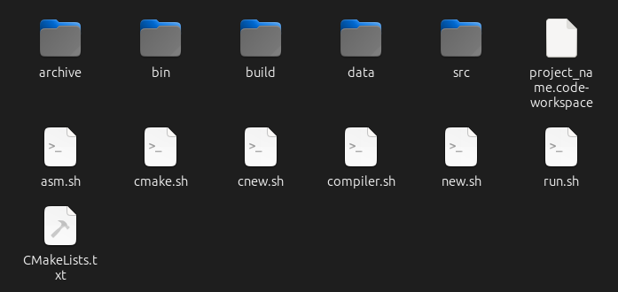

# C++ Project Creator

using of cpp project creator is very easy:
it runs oly on **linux systems**.

cpproject  my_project_path/folder_name
creates a C++ project with cmake configuration and C++ terminal command compilation.

cpproject  my_project_path/folder_name postgresql
creates a C++ project with cmake configuration and C++ terminal command,
with Postgresql configuration both for cmake and terminal command compilation.

## Files Explanation

    /bin  : contains binary file.
    /build: contains folder and files for cmake cmpilation.
    /data: for any data maybe developer using for test or any other porpuse.
    /scr: consist of C++ source files.
    cmake.sh: cmake compilation script.
    CMakeList.txt: cmake configuration.
    compiler.sh: C++ compile terminal command using by run.sh.
    new.sh: create new C++ source file.
    run.sh: compile and run the binary file.

## Using new.sh
    
    ./new.sh 001
    it make main_001.cpp file

## Using run.sh
    
    ./run.sh 001
    it compile and run main_001.cpp
